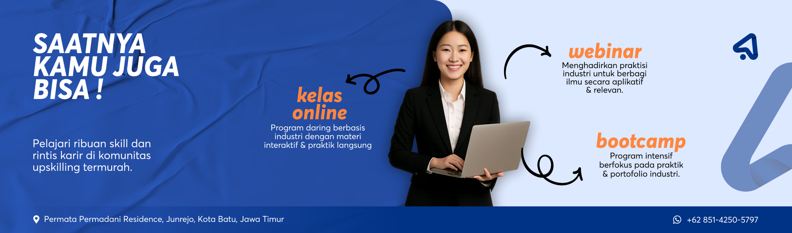

# 🎓 Aksademy

**Platform edukasi digital terdepan untuk meningkatkan karir profesionalmu.**

Aksademy adalah landing page modern untuk platform edukasi digital yang menyediakan berbagai program belajar seperti Bootcamp, Video Course, dan Webinar di bidang Web Development, Graphic Design, Data Science, dan Accounting & Tax.

---

## 🖼️ Preview



---

## 🚀 Tech Stack

| Teknologi | Versi | Deskripsi |
|---|---|---|
| **React** | 19.x | Library utama untuk UI |
| **Vite** | 7.x | Build tool & dev server |
| **Tailwind CSS** | 4.x | Utility-first CSS framework |
| **Framer Motion** | 12.x | Library animasi deklaratif |
| **Headless UI** | 2.x | Komponen UI aksesibel (Navbar) |
| **Heroicons** | 2.x | Ikon SVG dari tim Tailwind |

---

## 📁 Struktur Project

```
aksademy/
├── public/                  # Asset statis
│   ├── carousel-*.webp      # Gambar carousel hero
│   ├── illustration-*.webp  # Ilustrasi program
│   ├── *-icon.webp          # Ikon kategori
│   ├── logo-primary*.png    # Logo utama
│   ├── logo-secondary*.png  # Logo sekunder (footer)
│   └── icon-wa.svg          # Ikon WhatsApp
├── src/
│   ├── components/
│   │   ├── Navbar.jsx       # Navigasi dengan search & Ctrl+K
│   │   ├── Hero.jsx         # Hero section dengan carousel
│   │   ├── Category.jsx     # Kategori belajar
│   │   ├── Program.jsx      # Program unggulan
│   │   ├── Testimonial.jsx  # Testimoni alumni
│   │   └── Footer.jsx       # Footer
│   ├── App.jsx              # Root component
│   ├── main.jsx             # Entry point
│   └── index.css            # Global CSS & Tailwind theme
├── index.html               # HTML template
├── vite.config.js           # Konfigurasi Vite
├── package.json             # Dependencies & scripts
└── eslint.config.js         # Konfigurasi ESLint
```

---

## 🧩 Komponen

### 🔹 Navbar
- Navigasi responsif dengan Headless UI (`Disclosure`)
- **Fitur pencarian** dengan shortcut keyboard `Ctrl + K` / `⌘ + K`
- Dropdown hasil pencarian real-time dengan smooth scroll ke section
- Efek scroll: shadow & border muncul saat halaman di-scroll
- Animasi entrance dengan Framer Motion
- Menu mobile dengan hamburger toggle

### 🔹 Hero
- Image carousel otomatis dengan auto-scroll setiap 4 detik
- Navigasi carousel: tombol kiri/kanan & pagination dots
- Gesture support: drag/swipe dan snap scrolling
- CTA: "Mulai Sekarang" dan "Konsultasi" (WhatsApp)

### 🔹 Category
- Grid 4 kolom (responsif) menampilkan kategori belajar:
  - Web App Development
  - Graphic Design
  - Data Science
  - Accounting & Tax
- Animasi hover: scale-up gambar & elevasi card

### 🔹 Program
- 3 program unggulan dengan layout alternating (zig-zag):
  - **Bootcamp Profesional** — Program intensif 3–6 bulan
  - **Video Course (On-Demand)** — Belajar fleksibel seumur hidup
  - **Webinar & Workshop** — Kelas interaktif dengan expert
- Ilustrasi floating animation
- Slide-in animation (kiri/kanan)

### 🔹 Testimonial
- Layout masonry responsif (3 kolom desktop, 2 tablet, 1 mobile)
- 6 testimoni alumni dengan avatar, nama, dan handle
- Background dark theme (`#0B1120`)
- Stagger animation pada card

### 🔹 Footer
- 4 kolom: Tentang, Program, Kategori, Kontak
- Logo dengan filter invert untuk dark background
- Hover effect pada link navigasi
- Copyright dinamis (tahun otomatis)

---

## ⚡ Quick Start

### Prasyarat
- **Node.js** ≥ 18.x
- **npm** ≥ 9.x

### Instalasi

```bash
# Clone repository
git clone https://github.com/ferdiodwi/mini-project-aksademy
cd mini-project-aksademy

# Install dependencies
npm install

# Jalankan dev server
npm run dev
```

Buka `http://localhost:5173` di browser.

### Build Production

```bash
npm run build
npm run preview
```

---

## 🎨 Design System

### Palet Warna

| Variabel | Warna | Hex |
|---|---|---|
| Primary | 🔵 Navy Blue | `#14427D` |
| Primary Hover | 🔵 Dark Navy |`#0D3561` |
| Primary Light | 🔵 Light Blue | `#EAF1F8` |
| Secondary | 🟢 Emerald | `#10B981` |
| Bg Main | ⚪ Off-White | `#FAFAFB` |
| Text Main | ⚫ Dark Gray | `#111827` |
| Text Muted | 🩶 Gray | `#6B7280` |

### Font
- **Outfit** (Google Fonts) — weights: 300, 400, 500, 600, 700, 800

### Animasi
- `drift` — Floating background blobs
- `float` — Ilustrasi bouncing halus
- `scroll` — Auto-scroll horizontal
- Framer Motion: slide-up, slide-left/right, scale-up, stagger

---

## 📜 Scripts

| Script | Perintah | Deskripsi |
|---|---|---|
| Dev | `npm run dev` | Jalankan dev server (Vite) |
| Build | `npm run build` | Build untuk production |
| Preview | `npm run preview` | Preview build production |
| Lint | `npm run lint` | Jalankan ESLint |

---

## 📄 Lisensi

Hak Cipta © 2026 **Aksademy**. Hak Cipta Dilindungi.

---

<p align="center">
  Dibuat dengan ❤️ menggunakan React + Vite + Tailwind CSS
</p>
